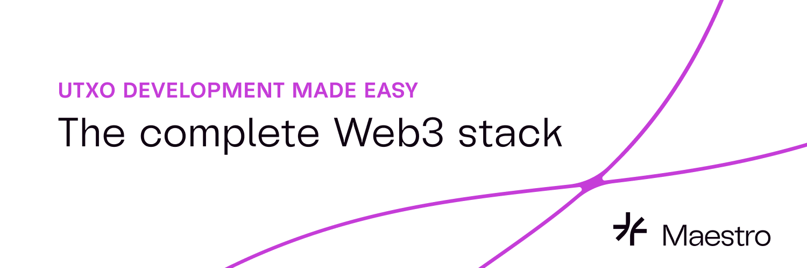

# Maestro

Welcome to **Maestro's Github org**!

We're a blockchain infrastructure provider focused on the Cardano blockchain.

Our team is building the most advanced dApp platform on Cardano, and to accomplish that mission we are actively working towards striking the perfect balance between open source software and managed, enterprise-grade services.

We welcome you to contribute to our many open source tools and our [dApp Platform](https://www.gomaestro.org/dapp-platform).

Finally, please don't hesitate to get in touch with us in any of the following ways:
* support@gomaestro.org
* [Discord](https://discord.gg/zvXv3TxD)
* [Telegram](https://t.me/GoMaestroOrg)

Hope to meet you soon!

